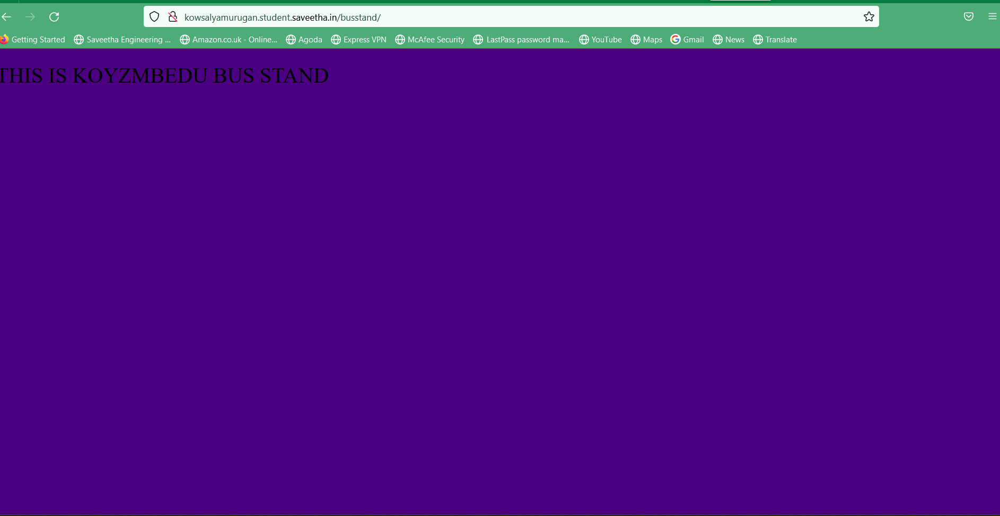
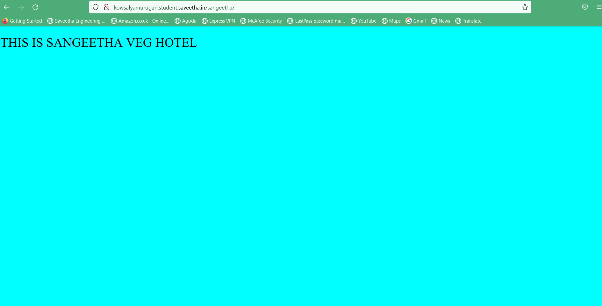
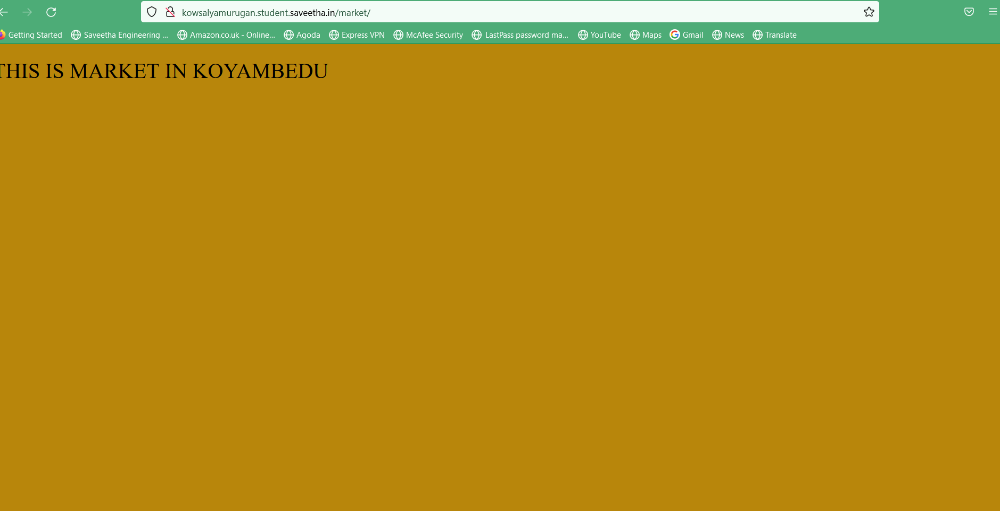
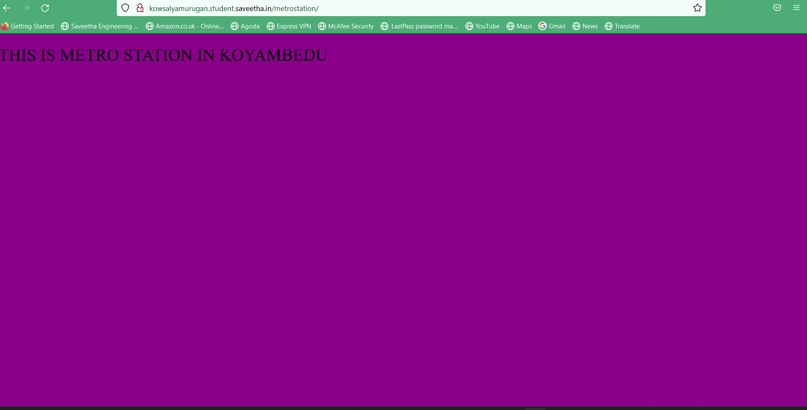
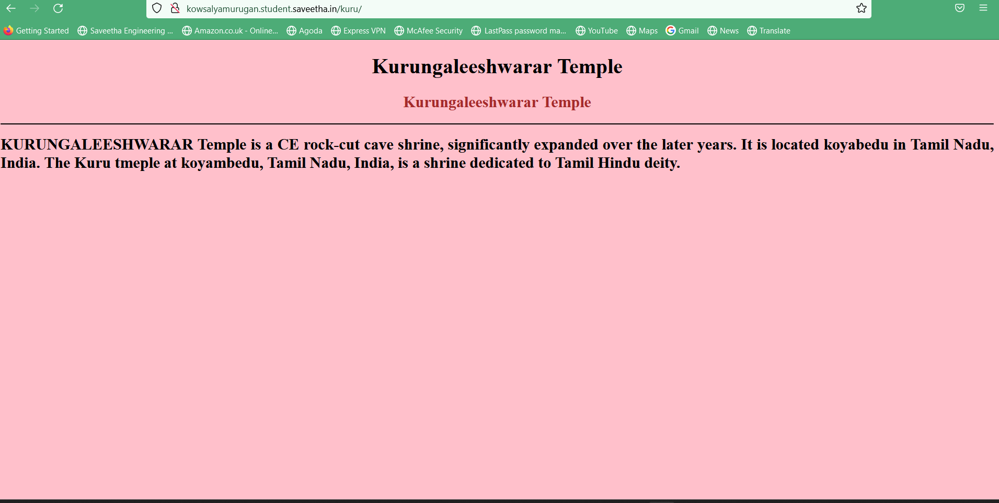
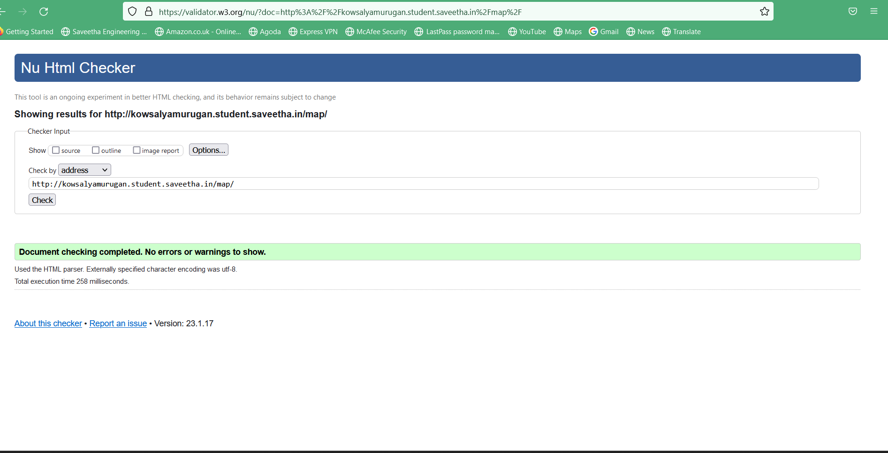

# Places Around Me
## AIM:
To develop a website to display details about the places around my house.

## Design Steps:

### Step 1:
Clone the github repository into theia IDE.
### Step 2:
Create a new django project.
### step 3:
```
<!DOCTYPE html>
<html lang="en">
<head>
    <title> KOYAMBEDU </title>
</head>
<body style="background-color: black;">
    
<MAP name="koyambedu">
    <area shape="RECT" coords="647,270,795,352" alt="metrostation" title="metrostation" href="/metrostation/">
    <area shape="RECT" coords="647,270,795,352" alt="sangeetha" title="sangeetha" href="/sangeetha/">
    <area shape="RECT" coords="182,490,463,662" alt="midnightdhaba" title="midnightdhaba" href="/midnightdhaba/">
    <area shape="RECT" coords="662,391,955,527" alt="bigboss" title="bigboss" href="/bigboss/">
    <area shape="RECT" coords="915,546,1185,748" alt="corporationpark" title="corporationpark" href="/corporationpark/">


</map>    
</body>
</html>
```
### step 4:
Run the django server and excute the HTML files.
## Code:
busstand:
<!DOCTYPE html>
<html lang ="en">
    <head>
        <title>BUS STAND</title>
    </head>
    <style>
h1 {
    font-weight:initial;
}
    </style>
<body style="background-color:indigo ;">
    <body>
        <h1>THIS IS KOYZMBEDU BUS STAND</h1>
    </body>
</html>
kuru:
<!DOCTYPE html>
<html lang="en">
<head>
<title>Kurungaleeshwarar Temple</title>
</head>
<body bgcolor="pink">
<h1 align="center">
<font color="black"><b>Kurungaleeshwarar Temple</b></font>
</h1>
<h2 align="center">
<font color="brown"><b>Kurungaleeshwarar Temple</b></font>
</h2>
<hr size="3" color="black">
<p align="justify">
<font face="Times New Roman" size="5">
<b>
    KURUNGALEESHWARAR Temple is a CE rock-cut cave shrine,
    significantly expanded over the later years. It is located koyabedu in Tamil Nadu, India.

    The Kuru tmeple at koyambedu, Tamil Nadu, India, is a shrine dedicated to Tamil Hindu deity.
</b>
</font>
</p>
</body>
</html>

map:
<!DOCTYPE html>
<html lang="en">
<head>
    <title> KOYAMBEDU </title>
</head>
<body style="background-color: black;">
    
<MAP name="koyambedu">
    <area shape="RECT" coords="647,270,795,352" alt="metrostation" title="metrostation" href="/metrostation/">
    <area shape="RECT" coords="647,270,795,352" alt="sangeetha" title="sangeetha" href="/sangeetha/">
    <area shape="RECT" coords="182,490,463,662" alt="midnightdhaba" title="midnightdhaba" href="/midnightdhaba/">
    <area shape="RECT" coords="662,391,955,527" alt="bigboss" title="bigboss" href="/bigboss/">
    <area shape="RECT" coords="915,546,1185,748" alt="corporationpark" title="corporationpark" href="/corporationpark/">


</map>    
</body>
</html>
market:
  <!DOCTYPE html>
<html lang ="en">
    <head>
        <title>KOYAMBEDU MARKET</title>
    </head>
    <style>
h1 {
    font-weight:initial;
}
    </style>
<body style="background-color:darkgoldenrod ;">
    <body>
        <h1>THIS IS MARKET IN KOYAMBEDU</h1>
    </body>
</html>

sangeetha:
<!DOCTYPE html>
<html lang ="en">
    <head>
        <title>SANGEETHA HOTEL</title>
    </head>
    <style>
h1 {
    font-weight:initial;
}
    </style>
<body style="background-color:aqua;">
    <body>
        <h1>THIS IS SANGEETHA VEG HOTEL</h1>
    </body>
</html>

## Output:







## Result:
The result is displayed.